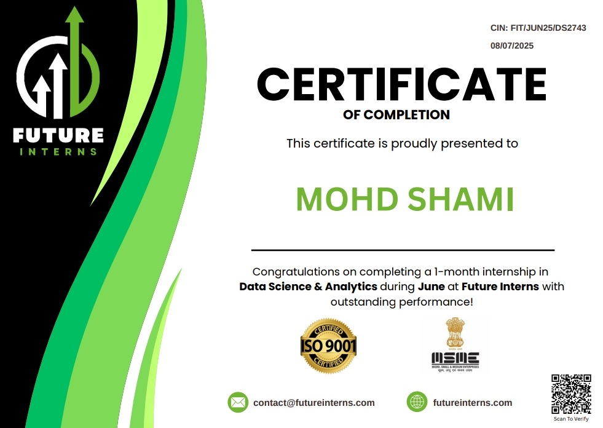
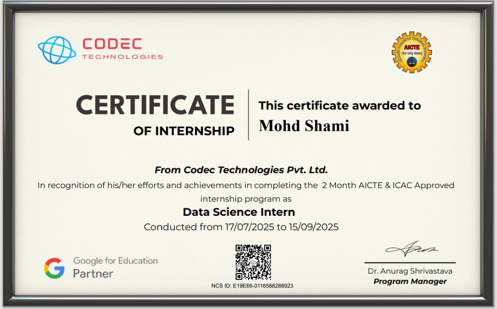

  
  #  Mohd Shami
  
  ###  Data Scientist | Machine Learning & AI | Mathematics | Problem Solving
  
  
  
  
  
  
  
  

---

  
### 🌟 Profile

---

  

Data Scientist who enjoys working with Python and Machine Learning to turn data into meaningful insights and real-world solutions.

-  **B.Tech in Data Science** - Teerthanker Mahaveer University
-  **Expertise**: Machine Learning, Predictive Modeling, Data Visualization
-  **Currently working on**: Advanced NLP and Deep Learning projects
-  **Learning**: Deep Learning, Transformers, and MLOps
-  **Goal**: To leverage AI for solving critical business challenges
-  **Fun fact**: I love exploring new technologies and contributing to open source

---

  
### 🛠️ Tech Stack & Tools

---

  
###  Programming Languages

  
###  Data Science & ML
  

  
###  Data 

###  Development Tools

###  Databases

---

  
### 💼 Professional Experience

---

##  Data Science Intern  
**Codect Technologies India** | *Aug 2025 - Oct 2025*

Implemented data-driven healthcare analysis solutions  

Built predictive models for medical diagnosis with 85% accuracy  

Conducted comprehensive community data research  

Presented insights to stakeholders through interactive dashboards  

 

##  Python Programming Intern  
**Codect IT Solutions Pvt Ltd** | *Jul 2025 - Aug 2025*

 Automated data processing tasks reducing manual work by 40%  
 
 Applied ML algorithms for business insights  
 
 Performed data analysis using Pandas and NumPy
 
 Developed Python scripts for data cleaning and preprocessing 
 

 

---

  
### 🏆 Certifications & Achievements

---

| Certification                                          | Organization    | Year |
| ------------------------------------------------------ | --------------- | ---- |
|  [Getting Started With Data](https://www.credly.com/go/xfaBdBho7bv2XizFFp7SNQ) | IBM | 2026 |
|  [Deep Learning](https://simpli.app.link/l68qN2W7DUb)     | SimpliLearn        | 2025 |
|  [SQL](https://www.hackerrank.com/certificates/93a9911f19f0)       | HackerRank        | 2025 |
|  [Problem Solving](https://www.hackerrank.com/certificates/fed0c5d043ec)        | HackerRank            | 2025 |
|  [Data Security Management](https://drive.google.com/file/d/13F0p5MrEF20Kgxx9MdfLcv5upBXShkTf/view?usp=drive_link) | NSDC | 2025 |
|  [Python ](https://www.hackerrank.com/certificates/a595e3f83464) | HackerRank| 2025 |
|  [AI/ML Learning Engineer](https://drive.google.com/file/d/1dx4WEqyP9gfZNq9OJQtY0PQ5ClCyaxPz/view?usp=drive_link) | Reliance Foundation | 2025 |
|  [Get started With Databricks for ML](https://drive.google.com/file/d/10456GFjAhFpjjn7sqsAOrJria2bODZqc/view?usp=drive_link) | SkillUP | 2025 |
|  [Data Science Essentials](https://drive.google.com/file/d/1Dea7BAZ2JmPO0n7ceq8I8a1Sh90cO8NL/view?usp=drive_link) | Skilling Academy | 2025 |
|  [NLP](https://drive.google.com/file/d/1oOFaTAMsGaiiFd6C8JxICbVowwLZ_0i_/view?usp=drive_link) | IntelliPaat | 2025 |
|  [ICAT](https://drive.google.com/file/d/1n7PfR9jOZY6kGiV3Kz6UMqMMroxJmbtO/view?usp=drive_link) | icat | 2025 |
|  [ML using Python](https://drive.google.com/file/d/13D9bmbRM10Pt2yKlZ9x371gioPRE2M5_/view?usp=drive_link) | SimpliLearn | 2025 |
|  [Data Science With Python](https://drive.google.com/file/d/19Yu2K29ZyaNvPrF5RWOboRlLnmJDrjN0/view?usp=drive_link) | Lets Upgrade | 2025 |
|  [Advanced Data Analysis Using Excel and PowerBI](https://drive.google.com/file/d/1pkNb71L7PAQcY6n2cDU9StCHZsIJiiwg/view?usp=drive_link) | ITM Edtech Training Pvt Ltd. | 2025 |
|  [HTML](https://drive.google.com/file/d/1iNySdN_N1npaRUyp8T0n1w9WKT1vSZjD/view?usp=drive_link) | IIT Bombay | 2025 |
|  [Introduction to Computers](https://drive.google.com/file/d/1BRZLQvV3BdjFx5WemKmJwb1T5HIF2jRK/view?usp=drive_link) | IIT Bombay | 2024 |
|  [Soft Skills For IT](https://drive.google.com/file/d/12qwEHBq7nADlYs0XYsChnA2SNSOY0fir/view?usp=drive_link) | Great Learning | 2023 |

---

  
### 📊 GitHub Analytics

---

---

  
### 📈 Contribution Graph

---

  
## 🎯 Current Focus

---

-  Deep Learning & Neural Networks
-  MLOps and Model Deployment
-  Natural Language Processing (Transformers)
-  Cloud Computing (AWS/Azure)

---

## 📫 Let's Connect!

---

  

 **Email**: codexshami@gmail.com  
 **Phone**: +91 8923591576  
 **Portfolio**: [codexshami.github.io](https://codexshami.github.io)

---

  
### ⭐ If you like my work, consider giving a star to my repositories!

**Thanks for visiting!** 👨‍💻

